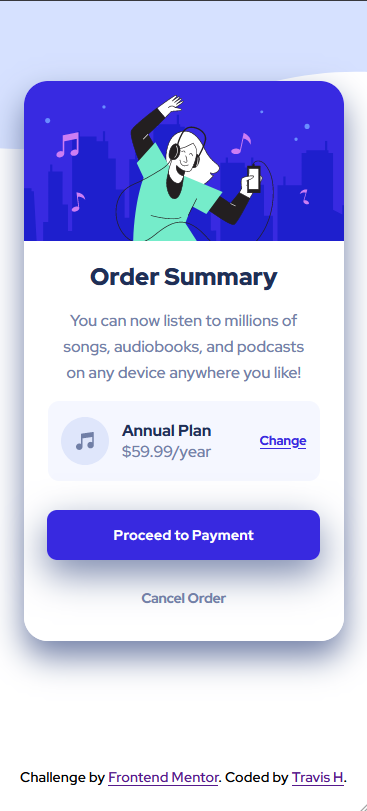

# Frontend Mentor - Order summary card solution

This is a solution to the [Order summary card challenge on Frontend Mentor](https://www.frontendmentor.io/challenges/order-summary-component-QlPmajDUj). 

## Table of contents

- [Frontend Mentor - Order summary card solution](#frontend-mentor---order-summary-card-solution)
  - [Table of contents](#table-of-contents)
  - [Overview](#overview)
    - [The challenge](#the-challenge)
    - [Screenshot](#screenshot)
    - [Links](#links)
  - [My process](#my-process)
    - [Built with](#built-with)
  - [Author](#author)

**Note: Delete this note and update the table of contents based on what sections you keep.**

## Overview

### The challenge

Users should be able to:

- See hover states for interactive elements

### Screenshot

Desktop View

Mobile View

### Links

- Solution URL: [Solution URL](https://github.com/TravisH-bot/order-summary-component-main)
- Live Site URL: [Live site URL](https://travish-bot.github.io/order-summary-component-main/)

## My process

### Built with

- Semantic HTML5 markup
- CSS custom properties
- Flexbox
- Media Queries

## Author

- Website - [Travis Hackbarth](https://travish-bot.github.io/My-Portfolio/)
- Frontend Mentor - [@TravisH-bot](https://www.frontendmentor.io/profile/TravisH-bot)

